# lab04groupEDA
<table>
    <theader>
        <tr>
            <td></td>
            <th>
                <span style="font-weight:bold;">UNIVERSIDAD NACIONAL DE SAN AGUSTIN</span><br />
                <span style="font-weight:bold;">FACULTAD DE INGENIERÍA DE PRODUCCIÓN Y SERVICIOS</span><br />
                <span style="font-weight:bold;">ESCUELA PROFESIONAL DE INGENIERÍA DE SISTEMAS</span>
            </th>
            <td></td>
        </tr>
    </theader>
    <tbody>
        <tr><td colspan="3"><span style="font-weight:bold;">Formato</span>: Guía de Práctica de Laboratorio / Talleres / Centros de Simulación</td></tr>
        <tr><td><span style="font-weight:bold;">Aprobación</span>:  2022/03/01</td><td><span style="font-weight:bold;">Código</span>: GUIA-PRLD-001</td><td><span style="font-weight:bold;">Página</span>: 1</td></tr>
    </tbody>
</table>
</div>
<div align="center">
    <span style="font-weight:bold;"><h2>INFORME DE LABORATORIO 8</h2></span>
</div>


<table>
<theader>
    <tr><th colspan="6" style="width:50%; height:auto; text-align:center">INFORMACIÓN BÁSICA</th></tr>
</theader>
<tbody>
    <tr>
        <td>ASIGNATURA:</td><td colspan="5">Estructuras de Datos y Algoritmos</td>
    </tr>
    <tr>
       <td>TÍTULO DE LA PRÁCTICA:</td><td colspan="5">Gráfos</td>
    </tr>
    <tr>
        <td>NÚMERO DE PRÁCTICA:</td><td>07</td><td>AÑO LECTIVO:</td><td>2022 A</td><td>NRO. SEMESTRE:</td><td>III</td>
    </tr>
    <tr>
        <td colspan="2">FECHA DE PRESENTACIÓN:</td><td>21-Agosto-2022</td><td colspan="2">HORA DE PRESENTACIÓN:</td><td>11:55</td>
    </tr>
    <tr>
        <td colspan="3">INTEGRANTES:
        <ol>
        <li>Blanco Trujillo, Antony Jacob</li>
        <li>Checalla Soto, Edisson Franklin</li>
        <li>Vilca Suelo, Gionvanni Gabriel</li>
        </ol>
        </td>
        <td colspan="2"> NOTA:</td>
        <td>     </td>
    </tr>
    <tr>
        <td colspan="6">DOCENTE:<br>
        Mg. Richart Smith Escobedo Quispe
        </td>
    </tr>
</table>

#

## EJERCICIO 1

Implementar el cogido de Grafo cuya representacion sea realizada mediante
LISTA DE ADYACENCIA. 

##	Pasos
# 
- Implementamos un metodo para los nodos con un vertice  unidireccional
```sh 
	 public static void addEdge(LinkedList<LinkedList<Integer>> Adj, int u,int v)
    {
        Adj.get(u).add(v);
    }
 
```
- Como siguiete paso metodo para mostrar la lista de adyacencia
```sh 
	public static void printadjacencylist(LinkedList<LinkedList<Integer> > adj)
    {
        for (int i = 0; i < adj.size(); ++i) {
            if (adj.get(i).size() != 0) {
                System.out.print(i + "->");
                for (int v : adj.get(i)) {
                    System.out.print(v + " ");
                }
                System.out.println();
            }
        }
    }
```
- Como ultimo paso en metodo main se inserta el numero de vertices con sus valores como ejemplo.
```sh 
	public static void main(String[] args) {
        int V = 5;
 
        LinkedList<LinkedList<Integer>> adj = new LinkedList<LinkedList<Integer>>();
 
        for (int i = 0; i < V; ++i) {
            adj.add(new LinkedList<Integer>());
        }
   
        addEdge(adj, 0, 1);
        addEdge(adj, 0, 4);
        addEdge(adj, 1, 2);
        addEdge(adj, 1, 3);
        addEdge(adj, 1, 4);
        addEdge(adj, 2, 3);
        addEdge(adj, 3, 4);
 
        printadjacencylist(adj);
    }
```

#
## EJERCICIO 2

Implementar BSF, DFS y Dijkstra con sus respectivos casos de prueba.

## ¿Como puedo compilar correctamente este ejercicio?

Despúes de clonar este repositorio, para poder ejecutar el código sin dificultad es recomendable que se ejecute desde el IDE eclipse, pues su desarrollo se dio en este,y por ello mismo es que se subieron tambien los archivos necesarios para ejecutarse ahí. 

- Enlace a todas las clases Implementadas para este ejercicio en GitHub : [Ver Código](https://github.com/AntonyBlanco/lab08groupEDA/tree/echecalla/Ejercicios/Ejercicio2)

#
##	Parte 1 (BSF)
#

- Enlace a todas las clases Implementadas para este ejercicio en GitHub : [Ver Código](https://github.com/AntonyBlanco/lab08groupEDA/blob/echecalla/Ejercicios/Ejercicio2/BFS.java)


```sh 
	private GrafoNDNP grafo;
	private int cantNodos;
	private int cantAristas;

	private int nodoInicial;
	private ArrayList<Arista> arbol;
	private boolean[] nodoTerminado;
```

## ¿Como lo hicimos?
Para esta primera implementación vamos a requerir implementar varias clases, la primera: la clase [BFS.java](https://github.com/AntonyBlanco/lab08groupEDA/blob/echecalla/Ejercicios/Ejercicio2/BFS.java) que tiene como atributos:


##	Entrada a partir de archivo grafo.in

Para este ejercicio vamos a hace ruso de un archivo plano externo, en este caso:

<div align="center">


</div>

-	La primera fila sirve de entrada de datos del grafo:

Para ejecutar correctamente esta implementación necesitamos, cambiar la ruta en esta parte del código: esta en la clase Test.java

<div align="center">

 
</div>

-	9-->	cantidad de nodos
-	10-->	Cantidad de Aristas
-	0-->	Puntaje de adyacencia
-	27-->	Grado Maximo
-	3-->	Grado Minimo
-	1-->	Nodo Inicial

-	A partir de la sefunda fila, es donde se encuentran la información de los nodos de un grafos y el nodo adyacente.

##	Salida en la Consola:


<div align="center">


</div>

##	Representación Gráfica:


<div align="center">

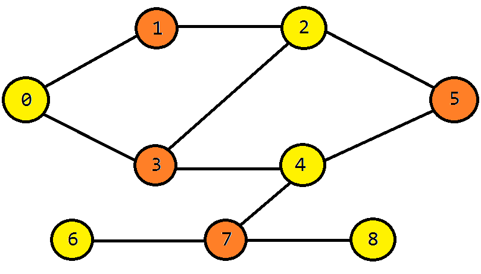
</div>


#
##	Parte 2 (DFS)
#

- Enlace a todas las clases Implementadas para este ejercicio en GitHub : [Ver Código](https://github.com/AntonyBlanco/lab08groupEDA/blob/echecalla/Ejercicios/Ejercicio2/DFS.java)


```sh 
	private GrafoNDNP grafo;
	private int cantNodos;
	private int cantAristas;

	private int nodoInicial;
	private ArrayList<Arista> arbol;
	private boolean[] nodoTerminado;
```

## ¿Como lo hicimos?
Para esta primera implementación vamos a requerir implementar varias clases, la primera: la clase [BFS.java](https://github.com/AntonyBlanco/lab08groupEDA/blob/echecalla/Ejercicios/Ejercicio2/BFS.java) que tiene como atributos:


##	Entrada a partir de archivo grafo.in

Para este ejercicio vamos a hace ruso de un archivo plano externo, en este caso:

<div align="center">


</div>

-	La primera fila sirve de entrada de datos del grafo:

Para ejecutar correctamente esta implementación necesitamos, cambiar la ruta en esta parte del código: esta en la clase Test.java

<div align="center">

 
</div>

-	9-->	cantidad de nodos
-	10-->	Cantidad de Aristas
-	0-->	Puntaje de adyacencia
-	27-->	Grado Maximo
-	3-->	Grado Minimo
-	1-->	Nodo Inicial

-	A partir de la sefunda fila, es donde se encuentran la información de los nodos de un grafos y el nodo adyacente.

##	Salida en la Consola:


<div align="center">


</div>
##	Representación Gráfica:


<div align="center">

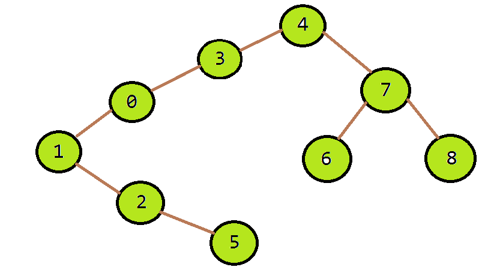
</div>


#
##	Parte 3 (DIJKSTRA)
#

- Enlace a todas las clases Implementadas para este ejercicio en GitHub : [Ver Código](https://github.com/AntonyBlanco/lab08groupEDA/blob/echecalla/Ejercicios/Ejercicio2/BFS.java)


```sh 
	private GrafoNDP grafo;
	private int nodoInicial;

	private int cantNodos;
	boolean nodoTerminado[];
	private ArrayList<CostoAlNodo> costos;

	private static final int INFINITO = -1;
```

## ¿Como lo hicimos?
Para esta primera implementación vamos a requerir implementar varias clases, la primera: la clase [BFS.java](https://github.com/AntonyBlanco/lab08groupEDA/blob/echecalla/Ejercicios/Ejercicio2/BFS.java) que tiene como atributos:


##	Entrada a partir de archivo grafo.in

-	La primera fila sirve de entrada de datos del grafo:

Para ejecutar correctamente esta implementación necesitamos, cambiar la ruta en esta parte del código: esta en la clase Test.java

<div align="center">

 
</div>

-	6-->	cantidad de nodos
-	9-->	Cantidad de Aristas
-	0-->	Puntaje de adyacencia
-	33-->	Grado Maximo
-	4-->	Grado Minimo
-	2-->	Nodo Inicial

-	A partir de la sefunda fila, es donde se encuentran la información de los nodos de un grafos y el nodo adyacente.

##	Salida en la Consola:


<div align="center">


</div>

##	Representación Gráfica:


<div align="center">

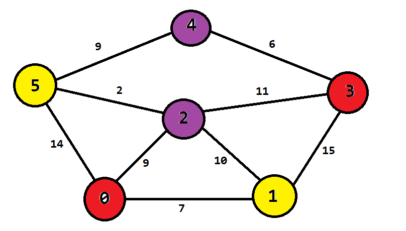
</div>


## EJERCICIO 3

Solucionar el siguiente ejercicio: (5 puntos)<br>
						El grafo de palabras se define de la siguiente manera: cada vértice es una palabra
						en el idioma Inglés y dos palabras son adyacentes si difieren exactamente en una
						posición. Por ejemplo, las **cords** y los **corps** son adyacentes, mientras que los
						**corps** y **crops** no lo son.
						<p>a) Dibuje el grafo definido por las siguientes palabras: words cords corps coops
crops drops drips grips gripe grape graph</p> 
						<p>Segun el enunciado, se definen los siguientes requisitos para que 2 vértices sean adyacentes:</p>
						<ul>
							<li>Misma cantidad de letras</li>
							<li>Mismas letras en la misma posición, menos una de las letras</li>
						</ul>
						<p>Se definen los casos para que no exista adyacencia:</p>
						<ul>
							<li>Mismas letras pero al menos dos intercambiaron posición</li>
						</ul>
                        <p>A continuación se muestra el procedimiento visual para construir el grafo:</p>
                        <ul>
                            <li>
                                <p>Se inserta el nodo "words" al grafo vacío, al no existir otros nodos entonces no se compara</p>
                                
                            </li>
                            <li>
                                <p>Se inserta el nodo "cords", el grafo posee un unico nodo, entonces se comparan los nodos para verificar si pueden ser adyacentes, como solo difieren de la letra en la posicion 0 entonces son adyacentes</p>
                                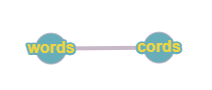
                            </li>
                            <li>
                                <p>Se inserta el nodo "corps", se comparan los nodos existentes con el nodo a insertar y tenemos que solo "cords" es adyacente a "corps"</p>
                                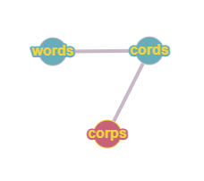
                            </li>
                            <li>
                                <p>Se inserta el nodo "coops", se comparan los nodos existentes con el nodo a insertar y tenemos que solo "corps" es adyacente a "coops"</p>
                                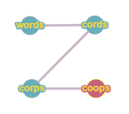
                            </li>
                            <li>
                                <p>Se inserta el nodo "crops", se comparan los nodos existentes con el nodo a insertar y tenemos que solo "coops" es adyacente a "crops"</p>
                                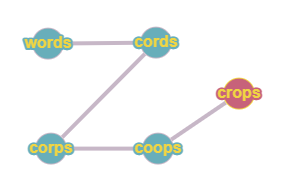
                            </li>
                            <li>
                                <p>Se inserta el nodo "drops", se comparan los nodos existentes con el nodo a insertar y tenemos que solo "crops" es adyacente a "drops"</p>
                                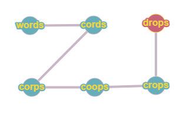
                            </li>
                            <li>
                                <p>Se inserta el nodo "drips", se comparan los nodos existentes con el nodo a insertar y tenemos que solo "drops" es adyacente a "drips"</p>
                                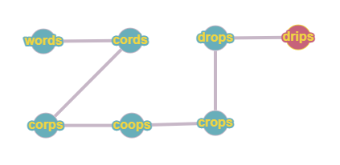
                            </li>
                            <li>
                                <p>Se inserta el nodo "grips", se comparan los nodos existentes con el nodo a insertar y tenemos que solo "drips" es adyacente a "grips"</p>
                                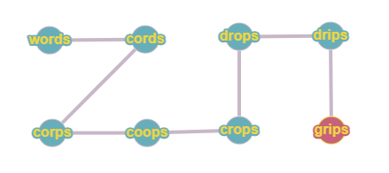
                            </li>
                            <li>
                                <p>Se inserta el nodo "gripe", se comparan los nodos existentes con el nodo a insertar y tenemos que solo "grips" es adyacente a "gripe"</p>
                                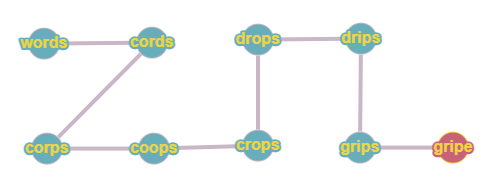
                            </li>
                            <li>
                                <p>Se inserta el nodo "grape", se comparan los nodos existentes con el nodo a insertar y tenemos que solo "gripe" es adyacente a "grape"</p>
                                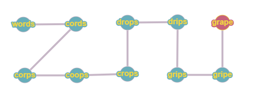
                            </li>
                            <li>
                                <p>Se inserta el nodo "graph", se comparan los nodos existentes con el nodo a insertar y tenemos que solo "grape" es adyacente a "graph"</p>
                                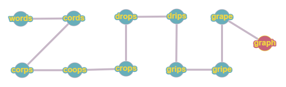
                            </li>
                        </ul>
						<p>b) Mostrar la lista de adyacencia del grafo.</p>
					</li>
                </ol>
            </td>
        </tr>
        <tr>

#
<div align="center">
    <span style="font-weight:bold;"><h2>CUESTIONARIO </h2></span>
</div>

¿Cuantas variantes del algoritmo de Dijkstra hay y cuál es la diferencia entre
ellas?
-   El algoritmo existe en muchas variantes. El algoritmo original de Dijkstra encontró la ruta más corta entre dos nodos dados, pero una variante más común fija un solo nodo como el nodo "fuente" y encuentra las rutas más cortas desde la fuente a todos los demás nodos en el gráfico, produciendo una ruta más corta árbol.

-   En presentaciones comunes del algoritmo de Dijkstra, inicialmente todos los nodos se ingresan en la cola de prioridad. Sin embargo, esto no es necesario: el algoritmo puede comenzar con una cola de prioridad que contiene solo un elemento e insertar nuevos elementos a medida que se descubren (en lugar de hacer una disminución de clave, verifique si la clave está en la cola; si es, disminuya su clave, de lo contrario insértela). Esta variante tiene los mismos límites en el peor de los casos que la variante común, pero mantiene una cola de prioridad más pequeña en la práctica, lo que acelera las operaciones de la cola.

Invetigue sobre los ALGORITMOS DE CAMINOS MINIMOS e indique, ¿Qué
similitudes encuentra, qué diferencias, en qué casos utilizar y porque?

-   Dijkstra: resuelve el problema de los caminos más cortos desde un único nodo origen hasta todos los otros nodos del grafo (aunque aplicando una regla de repetición del algoritmo, se puede automatizar la resolución del problema desde todos los nodos de origen hasta todos los nodos del grafo).

-   Bellman-Ford: resuelve el problema de los caminos más cortos desde un origen permitiendo que la ponderación de los nodos sea negativa.

-   Algoritmo de Búsqueda A*: resuelve el problema de los caminos más cortos entre un par de nodos usando la heurística para agilizar la búsqueda.

-   Algoritmo de Floyd-Warshall: resuelve el problema de los caminos más cortos entre todos los nodos.

-   Algoritmo de Johnson: resuelve el problema de los caminos más cortos entre todos los nodos y puede ser más rápido que el de Floyd-Warshall en grafos de baja densidad.

-   Algoritmo de Viterbi: resuelve el problema del camino estocástico más corto con un peso probabilístico adicional en cada nodo.

#
<div align="center">
    <span style="font-weight:bold;"><h2>CONCLUSIONES </h2></span>
</div>

-   las implementaciones resultaron complejas, pero haciendo uso de estructuras de datos aprendidas solventamos los ejercicios.. 

-   Hasta ahora teniamos los conceptos de gráfos comprendidos en gran medida solo teoricamente, peor despúes de este laboratorio hemos profundizado y llegado a entender posibles apliacaciones reales.
#
<div align="center">
    <span style="font-weight:bold;"><h2>RETROALIMENTACIÓN </h2></span>
</div>

#

-   

#
<div align="center">
    <span style="font-weight:bold;"><h2>REFERENCIAS Y BIBLIOGRAFÍA </h2></span>
</div>

#

-   https://www.w3schools.com/java/
-   https://www.eclipse.org/downloads/packages/release/2022-03/r/eclipse-ide-enterprise-java-and-web-developers
-   https://lineadecodigo.com/java/usar-una-hashtable-java/
-  https://hmong.es/wiki/Dijkstra%27s_algorithm
-   http://scielo.sld.cu/scielo.php?script=sci_arttext&pid=S1815-59362017000100004
